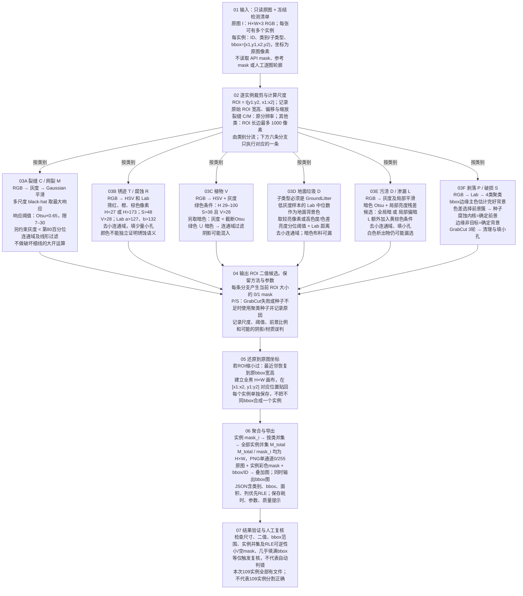
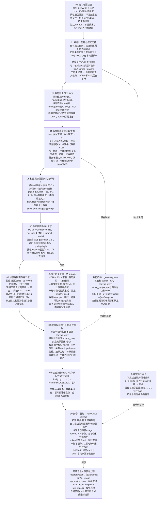

# 三种mask生成方法：处理流程与数据流

依据当前实现绘制；参考标注只在评估阶段使用。蓝=输入，灰=处理，黄=判断，绿=数据产物，红=异常/回退。

## 纯 OpenCV：原图像素规则分割

对应 skills/facade-opencv-mask/scripts/segment.py。基线不使用模型mask，亦不使用assisted人工引导。

## image2.5：局部画布 → 模型mask → 原图坐标

对应 batch_local.py / local_crop_trial.py / api_adapter.py / run.py。VS Code只负责运行Python，不是分割模型。

## image2.5 + OpenCV：先验约束精修与回退

对应 refine_api_masks.py。是可选后处理；与04号此前的人工轮廓辅助精修不同。

```mermaid
flowchart TD
  i["01 输入：原图 + 冻结目标 + 已有API实例mask<br/>原图 I(H×W×3)、mask_i(H×W 0/255)、bbox、类别/ID、源文件哈希<br/>只使用这批API输出作为先验；不读取参考真值、人工轮廓<br/>输入缺少API实例 → 保持缺失/partial，不新增分割结果"]
  check["02 校验并保留原稿<br/>核对图像哈希、尺寸、二值值域及mask在bbox内<br/>空输入mask：原样回退并记录empty_input<br/>复制原图、原API总mask/叠加图；逐实例原稿单独保存"]
  band["03 确定搜索范围和处理尺度<br/>band=clip(round(bbox短边×2.5%), 4, 32) 原图像素<br/>取bbox外扩band的原图ROI；allowed只允许冻结bbox内部<br/>裂缝C/M不缩小；其他类：ROI长边最多1200，记录scale<br/>outer = 膨胀(API mask, round(band×scale)) ∩ allowed"]
  crack["04A 裂缝 C / 网裂 M：在搜索带中找暗线<br/>ROI RGB → 灰度 → 3×3 Gaussian(σ=0.6)<br/>椭圆核半径2/4/8的black-hat响应，逐像素取最大<br/>仅在outer取样求Otsu阈值，阈值下限4<br/>candidate = outer ∩ (response > threshold)<br/>8邻域连通域，移除面积<3的小孤点<br/>不做大范围闭运算，不依靠参考裂缝定位"]
  region["04B 其他类别：API先验初始化 GrabCut<br/>outer外=确定背景；outer内=可能背景<br/>原API mask内=可能前景；腐蚀内核=确定前景<br/>内核不足5像素：尝试距离变换>1的内部点<br/>前景/背景仍不足 → 异常回退<br/>固定随机种子，GrabCut 4轮；只取outer内前景<br/>与纯OpenCV基线不同：不再按各类别单独颜色阈值"]
  restore["05 候选还原与bbox限制<br/>若缩小过：最近邻恢复ROI原尺寸，贴回H×W全黑画布<br/>candidate &= 冻结bbox；保存候选mask，不覆盖原API<br/>求解异常时保存与原mask相同的占位候选，并标solver_failed"]
  qc["06 异常筛选（不是准确率评估）<br/>计算面积比 r=候选面积/原mask面积，以及候选与原mask的IoU<br/>候选为空，或 r<0.35 / r>2.5，或 IoU<0.10 → 拒绝<br/>这是与API先验的分歧检查；API本身可能错误<br/>语义/裂缝/空腔风险另记复核标签，不单凭标签拒绝"]
  accept["07A 通过异常检查<br/>selected = candidate<br/>标记 refined_candidate；本次93个<br/>通过只代表未触发异常阈值，不保证变好"]
  fallback["07B 触发异常或求解失败<br/>selected = 原API mask<br/>标记 raw_fallback；本次12个<br/>保留候选/原因，不能把原有错误当作已修复"]
  export["08 聚合并保存三份实例结果<br/>raw_instance_masks：原稿；candidate_instance_masks：候选<br/>instance_masks：最终选用；按类与全图并集 → mask和叠加图<br/>JSON/RLE记录source_mask_sha256、尺度、搜索半径、面积变化<br/>记录opencv_seconds与回退原因；新增API请求/token/费用均为0"]
  eval["09 单独评估与复核（只读，不反馈调参）<br/>检查尺寸/二值/bbox/RLE/并集；先确认文件一致性<br/>需要评估时才读取参考mask：实例ID、类型、bbox和原图哈希对齐<br/>输出IoU、Dice、精确率、召回率、2px边界F1；人工看前后叠加<br/>本次区域宏IoU提高，但边界F1下降：不能自动覆盖所有原稿"]
  i --> check
  check --> band
  band -->|"C/M"| crack
  band -->|"其他类别"| region
  crack --> restore
  region --> restore
  restore --> qc
  qc -->|"通过"| accept
  qc -->|"拒绝/异常"| fallback
  accept --> export
  fallback --> export
  export --> eval
```

